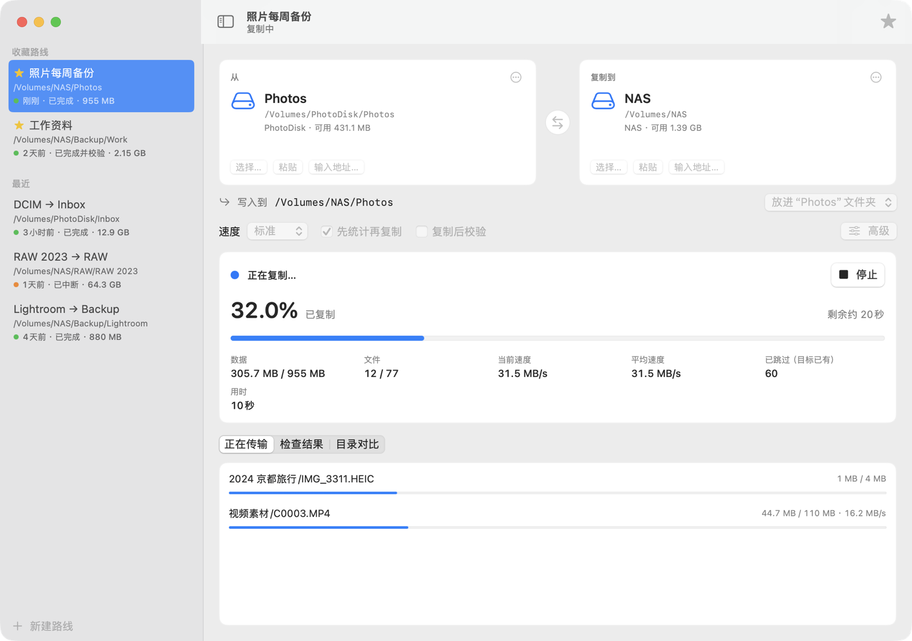

<div align="center">


# Disk Ferry

**Move big folders calmly: a native macOS copy tool for external drives, NAS and Windows shares**

[](https://github.com/kekincai/DiskFerry/actions/workflows/ci.yml)


[](LICENSE)

[简体中文](README.md) · English

<picture>
  <source media="(prefers-color-scheme: dark)" srcset="docs/screenshots/copying-dark.png">
  
</picture>

</div>

> The interface is currently in Simplified Chinese.

## Why

Copying hundreds of gigabytes of photos and video to an SMB share with Finder often means an unreliable progress bar, no clear way to resume after a disconnect, and thumbnails and Spotlight reading the disk in the background.

Disk Ferry hands the copy to [rclone](https://rclone.org/) and focuses on one thing: making "copy this folder from A to B" easy and trustworthy enough to do every day.

```text
external drive / local folder  ──rclone──▶  SMB share / NAS / another drive
```

## Highlights

- **Routes, not forms.** Every copy is saved as a route in the sidebar with its last result. Pin the ones you use often and re-sync with one click.
- **Set locations however is handy.** Drag a folder from Finder, paste a folder you copied with ⌘C, or type `smb://server/share/folder` or `\\server\share\folder`. Shares that are not mounted are connected with the standard macOS login sheet.
- **Always see where files land.** "Put into a folder of the same name" (like a Finder drag) or "merge into the destination", with the exact write path shown.
- **Accurate, cheap live progress.** Percent, bytes, files, current and average speed, ETA, skipped files and in-flight files come from rclone's own stats, refreshed once per second while only the progress area redraws.
- **Resume by running again.** Files already on the destination are skipped.
- **Nothing extra on disk.** No log files, summaries, thumbnails or caches. rclone's errors are shown in the window only when a run fails.
- Keeps the Mac awake while copying, shows progress on the Dock icon, notifies when a background copy finishes, and asks before quitting mid-copy.
- Optional size-only verification after copying (`rclone check --size-only`).

## Install

Requires macOS 13+ and rclone:

```bash
brew install rclone
git clone https://github.com/kekincai/DiskFerry.git
cd DiskFerry
./script/build_and_run.sh
```

The script builds `dist/DiskFerry.app`, which you can move to Applications.

## How live progress works

Each rclone process starts its remote-control server on `127.0.0.1` with a random password, and Disk Ferry polls `core/stats` once per second. The numbers are rclone's own accounting, not guesses from scanning folders.

```bash
rclone copy "$SOURCE" "$TARGET" \
  --check-first --local-no-clone \
  --transfers 1 --checkers 2 --retries 10 --low-level-retries 20 \
  --exclude ".DS_Store" --exclude "._*" --exclude ".Spotlight-V100/**" \
  --exclude ".Trashes/**" --exclude ".fseventsd/**" --exclude ".TemporaryItems/**" \
  --stats 0 --log-level NOTICE \
  --rc --rc-addr 127.0.0.1:<random port> --rc-user diskferry --rc-pass <random>
```

- `--check-first` compares everything before transferring, so totals and ETA are right from the start.
- `--local-no-clone` (added when the installed rclone supports it) makes rclone stream bytes itself instead of handing whole files to the OS, so large videos show smooth progress.

## Privacy and cache policy

Disk Ferry does not generate thumbnails, preview media, read EXIF, build a media database, hash every file by default, cache file contents, stage data locally, or write log files.

Local state is limited to settings and saved routes (`~/Library/Application Support/DiskFerry/recent_tasks.json`).

## Scripting

```bash
open -a DiskFerry --args -source /Volumes/PhotoDisk/Photos -target /Volumes/NAS -autostart YES
```

## Development

```bash
swift build
swift test          # includes an end-to-end copy when rclone is installed
```

Contributions are welcome — see [CONTRIBUTING.md](CONTRIBUTING.md). Disk Ferry should stay a low-cache copy controller, not a photo manager, file browser or indexer.

## License

MIT. See [LICENSE](LICENSE).
